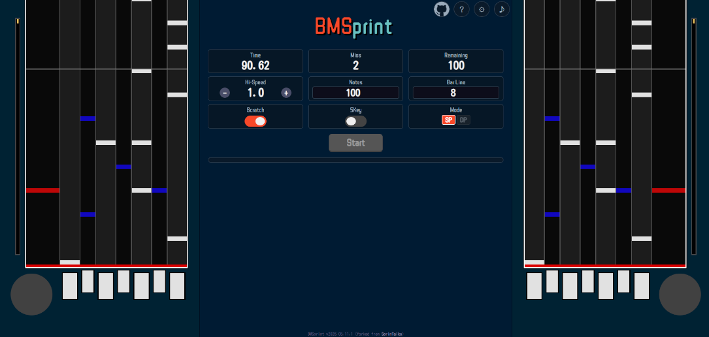

# BMSprint

BMS練習用ウェブサイト。

[** Play BMSprint **](https://escobar1616.github.io/BMSprint)

## Config

- **Adjustable Hi-Speed:** Change the speed at which notes travel.
- **Customizable Note Count:** Set the number of notes for each game session (from 10 upwards).
- **Key Configuration:** Freely assign keys for actions.
- **Bar Line Display:** Display bar lines at custom intervals to help with rhythm.
- **Scoring and Ranking:**
  - Your score is based on speed and accuracy (with a heavy emphasis on accuracy!).
  - The top 5 scores, along with miss counts, are saved locally in your browser.
- **Sound Customization:**
  - Adjust the master volume.
  - Upload your own sound files.
- **Share on X:** Post your results directly to Twitter from the result screen.
- **ノーツ色変更**
- **同時押しノーツ確率設定**
